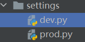
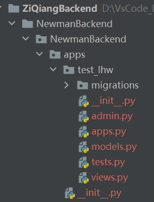
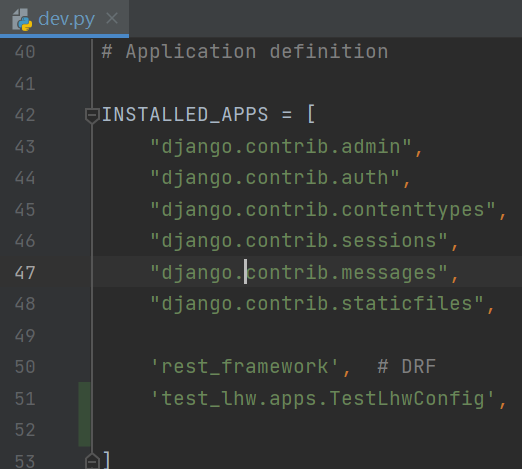

[TOC]

# ZiQiangBackend-珈有好食

## 开发要求

在主分支下拉取以各自name拼音缩写的分支
完成任务后merge到主分支

## 配置规范

参考所给的资料：美多商城/C01-Prepare/Config.html中的配置部分

参考：https://www.bilibili.com/video/BV1ya411A7C8?p=10&vd_source=763af5f146c65b47f793e885944c3b1b

## 截至11月22日进行的修改有：

- 将setting.py改成dev(开发使用)和prod(生产使用)两个文件，现在是开发阶段，使用dev作为配置文件

  

- 在dev中配置了mysql数据库，redis数据库

- 我们所写的应用在`NewmanBackend/NewmanBackend/apps`中进行，里面放了一个test_lhw应用：

  

  创建应用后记得在dev.py中INSTALLED_APPS添加:

  

- 日志文件还没有配置好

## 截至2023年2月5日进行的修改有：

- 使用Docker+uwsgi部署及运行

- 处理了图片上传和存储问题

- 由于服务器MySQL关闭了公网访问，我们使用Docker compose运行docker里的mysql服务

  

- 新增了管理端接口，除了使用Django自带的admin页面进行数据管理外，还设计了移动端上的管理页面对店铺进行认证管理

  

- 使用apifox进行接口管理和联调

  

- 之前的用户密码都是在数据库中明文存储，现改成了哈希加密存储，加强了安全性

- 后续考虑使用Django中内置的User模型

- 目录结构如下
```shell
:.
├─.idea
│  ├─dataSources
│  │  ├─3d0ebf7b-1579-4cce-87f8-8c3463d1db94
│  │  │  └─storage_v2
│  │  │      └─_src_
│  │  │          └─schema
│  │  ├─47fa2768-474d-4f48-af09-957923b68bca
│  │  │  └─storage_v2
│  │  │      └─_src_
│  │  │          └─schema
│  │  └─7dfe5944-0df4-4aab-a9e7-0604046ecf25
│  │      └─storage_v2
│  │          └─_src_
│  │              └─schema
│  └─inspectionProfiles
├─apps
│  └─mysql
│      └─conf
├─img
└─NewmanBackend
    ├─media
    │  ├─photos
    │  ├─photos_huitie
    │  └─photos_user
    ├─NewmanBackend
    │  ├─apps
    │  │  ├─collect
    │  │  │  ├─migrations
    │  │  │  │  └─__pycache__
    │  │  │  └─__pycache__
    │  │  ├─db
    │  │  │  ├─migrations
    │  │  │  │  └─__pycache__
    │  │  │  └─__pycache__
    │  │  ├─shop
    │  │  │  ├─migrations
    │  │  │  │  └─__pycache__
    │  │  │  └─__pycache__
    │  │  ├─shop_renzheng
    │  │  │  ├─migrations
    │  │  │  │  └─__pycache__
    │  │  │  └─__pycache__
    │  │  ├─signin
    │  │  │  ├─migrations
    │  │  │  │  └─__pycache__
    │  │  │  └─__pycache__
    │  │  ├─square
    │  │  │  ├─migrations
    │  │  │  │  └─__pycache__
    │  │  │  └─__pycache__
    │  │  ├─test_lhw
    │  │  │  ├─migrations
    │  │  │  │  └─__pycache__
    │  │  │  └─__pycache__
    │  │  ├─user
    │  │  │  ├─migrations
    │  │  │  │  └─__pycache__
    │  │  │  └─__pycache__
    │  │  └─__pycache__
    │  ├─logs
    │  ├─settings
    │  │  └─__pycache__
    │  ├─static
    │  │  ├─admin
    │  │  │  ├─css
    │  │  │  │  └─vendor
    │  │  │  │      └─select2
    │  │  │  ├─fonts
    │  │  │  ├─img
    │  │  │  │  └─gis
    │  │  │  └─js
    │  │  │      ├─admin
    │  │  │      └─vendor
    │  │  │          ├─jquery
    │  │  │          ├─select2
    │  │  │          │  └─i18n
    │  │  │          └─xregexp
    │  │  └─rest_framework
    │  │      ├─css
    │  │      ├─docs
    │  │      │  ├─css
    │  │      │  ├─img
    │  │      │  └─js
    │  │      ├─fonts
    │  │      ├─img
    │  │      └─js
    │  └─__pycache__
    ├─templates
    └─__pycache__
```

